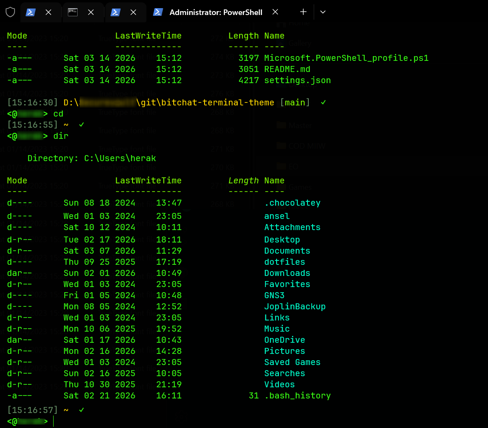

# bitchat-terminal-theme

> *Neon green. Pure black. No fluff.*

A Windows Terminal colour scheme and PowerShell profile inspired by **[bitchat](https://github.com/permissionlesstech/bitchat)** — the decentralised Bluetooth mesh chat app with the soul of a 90s IRC client.

---

## Preview



---

## Inspiration

The first time I saw bitchat, it wasn't the tech that hooked me — it was the *aesthetic*.

Pure black background. Neon green monospace text. Timestamps on every line. Directories in cyan. A prompt that looks like `<@nick>`. No gradients, no rounded corners, no dark-mode greys. Just signal and noise, rendered in phosphor green on a screen that feels like it's running at 3am on a rooftop.

---

## What's included

| File | Purpose |
|------|---------|
| `settings.json` | Windows Terminal colour scheme + dark tab bar |
| `Microsoft.PowerShell_profile.ps1` | Prompt with timestamps, path, git branch. PS5 + PS7 compatible |

---

## Colours

| Role | Hex | |
|------|-----|-|
| Primary / foreground | `#39FF14` | Neon green |
| Directories | `#00FFCC` | Cyan |
| Paths | `#FFD700` | Gold |
| Git branch | `#7FFF00` | Lime |
| Timestamps | `#3a5a3a` | Dim green |
| Error | `#FF4444` | Red |
| Background | `#000000` | Pure black |

---

## Quick Install

### 1. Font
```powershell
winget install JetBrains.JetBrainsMono
```

> If the font doesn't register: find the `.ttf` files → right-click → **Install for all users**.

### 2. Windows Terminal colour scheme

Press `Ctrl+,` → **Open JSON file** → replace contents with `settings.json` from this repo.

### 3. PowerShell profile
```powershell
Set-ExecutionPolicy -Scope CurrentUser RemoteSigned

if (Test-Path $PROFILE) { Copy-Item $PROFILE "$PROFILE.bak" }

Invoke-WebRequest -Uri "https://raw.githubusercontent.com/ed-dz/bitchat-terminal-theme/main/Microsoft.PowerShell_profile.ps1" -OutFile $PROFILE
```

Restart Windows Terminal.

---

## Credits

- **[bitchat](https://github.com/permissionlesstech/bitchat)** — the app that started all this
- **[JetBrains Mono](https://www.jetbrains.com/lp/mono/)** — the font
- **[Cascadia Mono](https://github.com/microsoft/cascadia-code)** — fallback font

---

*No accounts. No central servers. Just a shell that looks like it means business.*